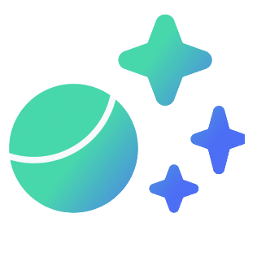
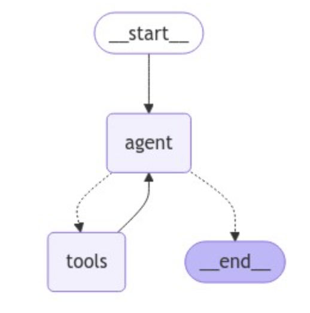

<!-- Improved compatibility of back to top link: See: https://github.com/othneildrew/Best-README-Template/pull/73 -->

<a id="readme-top"></a>

<!--
*** Thanks for checking out the Best-README-Template. If you have a suggestion
*** that would make this better, please fork the repo and create a pull request
*** or simply open an issue with the tag "enhancement".
*** Don't forget to give the project a star!
*** Thanks again! Now go create something AMAZING! :D
-->

<!-- PROJECT SHIELDS -->

<!--
*** I'm using markdown "reference style" links for readability.
*** Reference links are enclosed in brackets [ ] instead of parentheses ( ).
*** See the bottom of this document for the declaration of the reference variables
*** for contributors-url, forks-url, etc. This is an optional, concise syntax you may use.
*** https://www.markdownguide.org/basic-syntax/#reference-style-links
-->

[![Contributors][contributors-shield]][contributors-url]
[![Forks][forks-shield]][forks-url]
[![Stargazers][stars-shield]][stars-url]
[![Issues][issues-shield]][issues-url]
[![MIT License][license-shield]][license-url]
[![LinkedIn][linkedin-shield]][linkedin-url]

<!-- PROJECT LOGO -->

<br />
<div align="center">
  <a href="https://github.com/jtbrinas/elevate_playground.git">
    
  </a>

<h3 align="center">Legal Hub Chatbot</h3>

<p align="center">
    Legal Assistant powered by Gemini
    <br />
    <a href="https://github.com/jtbrinas/elevate_playground.git"><strong>Explore the docs »</strong></a>
    <br />
    <br />
    <a href="https://github.com/jtbrinas/elevate_playground.git">View Demo</a>
    ·
    <a href="https://github.com/jtbrinas/elevate_playground/issues/new?labels=bug&template=bug-report---.md">Report Bug</a>
    ·
    <a href="https://github.com/jtbrinas/elevate_playground/issues/new?labels=enhancement&template=feature-request---.md">Request Feature</a>
  </p>
</div>

<!-- TABLE OF CONTENTS -->

<details>
  <summary>Table of Contents</summary>
  <ol>
    <li>
      <a href="#about-the-project">About The Project</a>
      <ul>
        <li><a href="#built-with">Built With</a></li>
      </ul>
    </li>
    <li>
      <a href="#getting-started">Getting Started</a>
      <ul>
        <li><a href="#prerequisites">Prerequisites</a></li>
        <li><a href="#installation">Installation</a></li>
      </ul>
    </li>
    <li><a href="#deployment">Deployment</a></li>
    <li><a href="#design">Design</a></li>
    <li><a href="#usage">Usage</a></li>
    <li><a href="#future">Future</a></li>
    <li><a href="#roadmap">Roadmap</a></li>
    <li><a href="#contact">Contact</a></li>
  </ol>
</details>

<!-- ABOUT THE PROJECT -->

## About The Project

[![Product Name Screen Shot][product-screenshot]](jtbrinas.pythonanywhere.com)

This application is a simple chatbot designed to help explore the capabilities of Gemini in a legal context.

<p align="right">(<a href="#readme-top">back to top</a>)</p>

### Built With

* [LangChain](https://www.langchain.com/langchain)
* [LangGraph](https://langchain-ai.github.io/langgraph/)
* [Pinecone](https://www.pinecone.io/?utm_term=pinecone%20database&utm_campaign=Brand+-+US/Canada&utm_source=adwords&utm_medium=ppc&hsa_acc=3111363649&hsa_cam=16223687665&hsa_grp=133738612775&hsa_ad=582256510975&hsa_src=g&hsa_tgt=kwd-1628011569744&hsa_kw=pinecone%20database&hsa_mt=p&hsa_net=adwords&hsa_ver=3&gad_source=1&gclid=Cj0KCQjwrp-3BhDgARIsAEWJ6Sz7r4qVzWzbLSftCggFHTNYvZLJEPyfXn4l0L0vfmn7sYPGa0OVV9QaAgQEEALw_wcB)
* [Flask](https://flask.palletsprojects.com/en/3.0.x/)
* [Bootstrap][Bootstrap-url]

<p align="right">(<a href="#readme-top">back to top</a>)</p>

<!-- GETTING STARTED -->

## Getting Started

To host the app locally, follow the steps below.

### Prerequisites

1. Install [Poetry](https://python-poetry.org/docs/) to help download dependencies

### Installation
<a id="installation"></a>

1. Get the necessary keys:

* [Gemini API](https://ai.google.dev/gemini-api?gad_source=1&gclid=Cj0KCQjwrp-3BhDgARIsAEWJ6Swq_bYomTGkFNOxGD8XTlsvcWl3A2_l4RWSCMPmjiDyEICk6bkmRxYaAqFsEALw_wcB)
* [LangChain API](https://python.langchain.com/v0.1/docs/get_started/quickstart/)
* [Pinecone API](https://www.pinecone.io/?utm_term=pinecone%20database&utm_campaign=Brand+-+US/Canada&utm_source=adwords&utm_medium=ppc&hsa_acc=3111363649&hsa_cam=16223687665&hsa_grp=133738612775&hsa_ad=582256510975&hsa_src=g&hsa_tgt=kwd-1628011569744&hsa_kw=pinecone%20database&hsa_mt=p&hsa_net=adwords&hsa_ver=3&gad_source=1&gclid=Cj0KCQjwrp-3BhDgARIsAEWJ6SyueiB9lDFyOKqNYt5nNxx6hz4p06FxpM247-wJLaO9OeM6wLUm-i0aAulDEALw_wcB)
* Flask secret key: Below is how I created a secret key

  ```python
  import secrets
  secret_key = secrets.token_hex(32)
  ```

2. Clone the repo
   ```sh
   git clone https://github.com/jtbrinas/elevate_playground.git
   ```
3. Put the necessary keys into a .env file
   ```sh
   GOOGLE_API_KEY=[YOUR GEMINI KEY HERE]
   LANGCHAIN_API_KEY=[YOUR LANGCHAIN KEY HERE]
   PINECONE_API_KEY=[YOUR PINECONE KEY HERE]
   FLASK_SECRET_KEY=[YOUR FLASK SECRET KEY HERE]
   ```
4. Enter the cloned repo and install the necessary packages
   ```sh
   cd elevate_playground
   poetry install
   ```
5. Activate the virtual environment
   ```sh
   poetry shell
   ```
6. Run app.py to host the app locally
   ```sh
   python elevate_playground/app.py
   ```

<p align="right">(<a href="#readme-top">back to top</a>)</p>

## Deployment (Pythonanywhere)
<a id="#deployment"></a>

This section explains how I deployed the app on Pythonanywhere. I chose Pythonanywhere as it seemed the easiest for a small-scale Flask project.
Other deployment options may be better for the future of this app.

### Prerequisites
The size of the project requires at least the $5/month plan.

### Set up
1. Login to [Pythonanywhere](https://www.pythonanywhere.com/)
2. In the "Web" tab, select "Add new web app".
3. Seelct "Manual configuration"
4. Select "Python 3.10"
5. In the "Consoles" tab, select "Bash"
6. Create a virtual environment
    ```sh
    mkvirtualenv myvirtualenv --python=/usr/bin/python3.10
    ```
7. Follow the <a href="#installation">installation instructions</a> in the previous section
9. In the "Web" tab, put /home/[YOUR USER NAME]/elevate_playground as the Source code directory
10. Open the WSGI configuration file and paste in:
    ```python
    import os
    from dotenv import load_dotenv
    project_folder = os.path.expanduser('/home/[YOUR USER NAME]/elevate_playground/')
    load_dotenv(os.path.join(project_folder, '.env'))

    import sys
    path = '/home/[YOUR USER NAME]/elevate_playground/elevate_playground'
    if path not in sys.path:
        sys.path.append(path)
    from app import app as application
    ```
11. In the "Files" tab, navigate to /home/[YOUR USER NAME]/elevate_playground/elevate_playground/app.py
12. Find and comment out the following line of code:
    ```python
    load_dotenv()
    ``` 
13. Return the "Web" tab and select the reload option. The website should now be deployed!


<p align="right">(<a href="#readme-top">back to top</a>)</p>

<!-- USAGE EXAMPLES -->

## Usage
<a id="#usage"></a>

The chatbot is a legal assistant with the ability to interact with uploaded documents.

### Conversation
You can begin a conversation with the chatbot by selecting one of the three suggested prompt buttons and pressing the submit button. Otherwise, 
you can write your own prompt. The chatbot's memory is attached to each user's cookies. To clear the memory, clear cookies.

### Upload a file
At this point, the chatbot only accepts .pdf files. Use the paper clip button on the bottom left to upload a document. The chatbot does well
to extract information from documents. However, currently, it may struggle to recognize when you are asking a question about an uploaded document.
For the time being, prompts such as this may help the chatbot understand to access the documents: 
    "Use the retriever to [quesiton about the document]"
Otherwise, you can try copy and pasting the total document into the prompt.

_For more examples, please refer to the [Documentation](https://example.com)_

<p align="right">(<a href="#readme-top">back to top</a>)</p>


<!-- Design -->

## Design
<a id="#design"></a>

This section will go a little deeper into the design behind the project. The chatbot is powered by Gemini and uses the abstraction of Langchain and Langgraph. Pinecone is used as the vector store for storing uploaded documents.

### app.py
The chatbot is initialized when app.py is run. First the Pinecone index is created (if it does not already exist). Once the vector store is intialized, a retriever tool is created from it. This retriever tool is what allows the model to access the vector store for relevant information. The Gemini model is initialized through langchain (specific model can be changed at this
step). Flask app is created and the folders for file uploads and the vector store are created. Then a Langgraph graph is defined. Langgraph is an interesting tool that lets you create a path of logic for the chatbot. The graph is compiled to create a runnable. The runnable is the object we send the user's queries to.

#### Session history:
The /index route creates an ID for the user and stores it in the Flask session object. The dictionary called user is created and returned the information needed to initialize Pendo.

#### API calls:
The /api/generate route takes in the user query and feeds it to the langgraph. The final response is yielded back. The intermediate 
interactions between the agent and the retriever are printed to the terminal. This is an async function.

#### Workflow:
The chatbot allows users to upload documents and ask questions about them. Langgraph allows the LLM to use its reasoning
to decide when looking through the documents is appropriate for the task at hand. The graph for this app only has an agent node 
and a tool node which contains only a retriever. The agent takes in the user's query and decides if a tool call is necessary.
If so, the retriever is called and returns the information it thought was relevant to the query. The agent uses the new context
to generate a response that is then sent to the user. If the retriever wasn't deemed necessary, the agent generates a response
for the user directly. Below is the graph used. 



https://langchain-ai.github.io/langgraph/how-tos/tool-calling/

#### Document uploading:
The application supports user-uploaded documents. When a document is uploaded via the /upload route, the PyPDFLoader is used to load
the file. The text is split into chunks using one of Langchain's text splitters. The splits are added to the vectorstore.

### main.js
This file handles the form submission and the suggested prompt buttons. On submission, it makes a call to streamGemini in gemini-api.js.

### gemini-api.js
This file makes the POST request to app.py to make the API call. It also handles streaming the response back to main.js.

<p align="right">(<a href="#readme-top">back to top</a>)</p>

<!-- FUTURE CONSIDERATIONS -->

## Future considerations
<a id="#future"></a>

This section outlines some of the considerations for the future of this app.

### Session history
Session history is currently attached to cookies using Flask sessions. This means a user's chat session will persist until they refresh their cookies. Additionally, users cannot access past sessions. An alternative session management system should be implemented. Also, these sessions should be stored in a database, not in server.

### Database separation
The documents uploaded by users are shared by all. Because the retriever is global, I couldn't figure out how to have each user's retriever filter for documents uploaded by that user only. Pinecone has namespaces that separate documents, but I couldn't get it to work with the current set up with Flask session.

### Clear space
Currently, there is no mechanism to clear out sessions histories and document uploads as sessions end. The vector store will build up.

### Document interaction
The chatbot struggles to understand when a users question refers to a document they uploaded. Additionally the process of splitting documents into chunks loses the connection between the chunks. Pinecone has the ability to store extra metadata with the chunks of data, which may help with this. Or, other splitting techniques may be useful.

### Robustness
1. When uploading a document, it is displayed at the bottom input bar. However, the document is uploaded to the database without the submit button being pressed.

### Pendo
Users do not have to log in and so are identified using the same Flask sessions system. This means the same user can be counted twice if they refresh their cookies. If a login system is implemented, that could be used instead of the Flask sessions. The pendo.initialize() script in index.html would need to be appropriately adjusted. Also, tracking should be expanded. User prompts and histories are not collected, only whic features they used are tracked.

<p align="right">(<a href="#readme-top">back to top</a>)</p>


<!-- ROADMAP -->

## Roadmap

- [ ] Store chat sessions
- [ ] Separate user databases
- [ ] Implement streaming for deployed version
- [ ] Improve/expand Pendo tracking
- [ ] Improve response quality
  - [ ] Incorporate metadata into database
  - [ ] Experiment with different graphs
  - [ ] Experiment with different prompting

See the [open issues](https://github.com/jtbrinas/elevate_playground/issues) for a full list of proposed features (and known issues).

<p align="right">(<a href="#readme-top">back to top</a>)</p>

<!-- CONTRIBUTING -->

## Contributing
<a id="#contributing"></a>

Contributions are what make the open source community such an amazing place to learn, inspire, and create. Any contributions you make are **greatly appreciated**.

If you have a suggestion that would make this better, please fork the repo and create a pull request. You can also simply open an issue with the tag "enhancement".
Don't forget to give the project a star! Thanks again!

1. Fork the Project
2. Create your Feature Branch (`git checkout -b feature/AmazingFeature`)
3. Commit your Changes (`git commit -m 'Add some AmazingFeature'`)
4. Push to the Branch (`git push origin feature/AmazingFeature`)
5. Open a Pull Request

<p align="right">(<a href="#readme-top">back to top</a>)</p>

<!-- CONTACT -->

## Contact

Jeremy Brinas - jt.brinas@gmail.com

Project Link: [https://github.com/jtbrinas/elevate_playground.git](https://github.com/jtbrinas/elevate_playground.git)

<p align="right">(<a href="#readme-top">back to top</a>)</p>

<!-- MARKDOWN LINKS & IMAGES -->

<!-- https://www.markdownguide.org/basic-syntax/#reference-style-links -->

[contributors-shield]: https://img.shields.io/github/contributors/jtbrinas/elevate_playground.svg?style=for-the-badge
[contributors-url]: https://github.com/jtbrinas/elevate_playground/graphs/contributors
[forks-shield]: https://img.shields.io/github/forks/jtbrinas/elevate_playground.svg?style=for-the-badge
[forks-url]: https://github.com/jtbrinas/elevate_playground/network/members
[stars-shield]: https://img.shields.io/github/stars/jtbrinas/elevate_playground.svg?style=for-the-badge
[stars-url]: https://github.com/jtbrinas/elevate_playground/stargazers
[issues-shield]: https://img.shields.io/github/issues/jtbrinas/elevate_playground.svg?style=for-the-badge
[issues-url]: https://github.com/jtbrinas/elevate_playground/issues
[license-shield]: https://img.shields.io/github/license/jtbrinas/elevate_playground.svg?style=for-the-badge
[license-url]: https://github.com/jtbrinas/elevate_playground/blob/master/LICENSE.txt
[linkedin-shield]: https://img.shields.io/badge/-LinkedIn-black.svg?style=for-the-badge&logo=linkedin&colorB=555
[linkedin-url]: https://www.linkedin.com/in/jeremy-brinas/
[product-screenshot]: elevate_playground/templates/images/screenshot.png
[Next.js]: https://img.shields.io/badge/next.js-000000?style=for-the-badge&logo=nextdotjs&logoColor=white
[Next-url]: https://nextjs.org/
[React.js]: https://img.shields.io/badge/React-20232A?style=for-the-badge&logo=react&logoColor=61DAFB
[React-url]: https://reactjs.org/
[Vue.js]: https://img.shields.io/badge/Vue.js-35495E?style=for-the-badge&logo=vuedotjs&logoColor=4FC08D
[Vue-url]: https://vuejs.org/
[Angular.io]: https://img.shields.io/badge/Angular-DD0031?style=for-the-badge&logo=angular&logoColor=white
[Angular-url]: https://angular.io/
[Svelte.dev]: https://img.shields.io/badge/Svelte-4A4A55?style=for-the-badge&logo=svelte&logoColor=FF3E00
[Svelte-url]: https://svelte.dev/
[Laravel.com]: https://img.shields.io/badge/Laravel-FF2D20?style=for-the-badge&logo=laravel&logoColor=white
[Laravel-url]: https://laravel.com
[Bootstrap.com]: https://img.shields.io/badge/Bootstrap-563D7C?style=for-the-badge&logo=bootstrap&logoColor=white
[Bootstrap-url]: https://getbootstrap.com
[JQuery.com]: https://img.shields.io/badge/jQuery-0769AD?style=for-the-badge&logo=jquery&logoColor=white
[JQuery-url]: https://jquery.com
